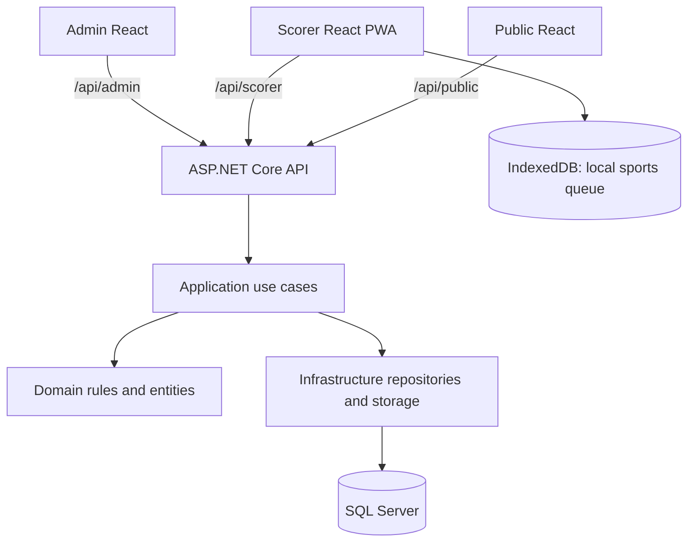
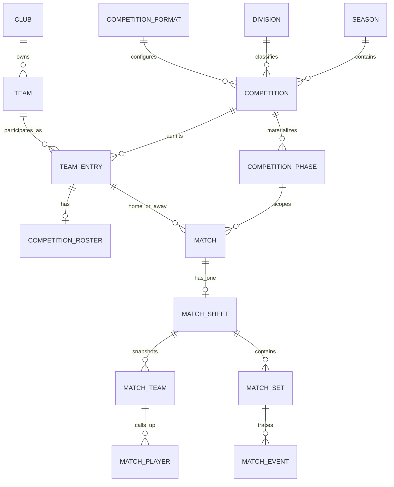
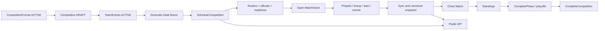

# LigaVolley — System Context

## 1. Propósito del sistema

LigaVolley administra competiciones de voleibol, prepara y opera el acta electrónica de cada partido y publica la información deportiva que corresponde hacer visible. El sistema tiene una única autoridad de negocio y persistencia: el backend ASP.NET Core. Sus tres consumidores son superficies deliberadamente distintas:

- **Admin** prepara catálogos, personas, formatos, competiciones, participantes, fixture, programación, planteles, oficiales y la supervisión de actas.
- **Scorer** es la consola deportiva del partido. Abre el acta, registra el juego y tolera conectividad intermitente con almacenamiento local y sincronización posterior.
- **Public** es una consulta anónima y de solo lectura de competiciones publicadas, fixture, resultados, tablas, playoffs, detalle y Live.

El backend comparte dominio, casos de uso y SQL Server; no es un conjunto de microservicios. Las superficies HTTP se separan por consumidor, por lo que sus DTO no se comparten automáticamente.

## 2. Arquitectura de alto nivel

LigaVolley es un **modular monolith**. `LigaVolley.Domain` contiene entidades y reglas; `LigaVolley.Application` orquesta casos de uso mediante puertos; `LigaVolley.Infrastructure` implementa EF Core/SQL Server, repositorios, almacenamiento de logos y seeders; `LigaVolley.Api` compone dependencias y publica Minimal APIs. Domain y Application no dependen de Infrastructure.

La autoridad canónica es servidor-side. El Scorer puede aceptar una acción localmente para permitir operación offline, pero la API valida causalidad, autoridad de sesión e integridad antes de consolidarla. Public nunca reproduce eventos ni calcula reglas deportivas en React. Admin también es server-centric y no dispone de modo offline deportivo.

## 3. Stack tecnológico actual

- Backend: .NET 10 (`net10.0`), ASP.NET Core Minimal API y C# con nullable e implicit usings activados.
- Persistencia: EF Core SQL Server 10.0.11, migraciones EF y SQL Server como única base operativa.
- API: Swashbuckle.AspNetCore 6.6.2; Swagger se habilita en Development. Los errores usan RFC Problem Details.
- Admin: React 18.3.1, TypeScript 5.6.2, Vite 5.4.8, React Router 6.26.2, TanStack Query 5.59.0, React Hook Form, Zod y Vitest.
- Scorer: React 18.3.1, TypeScript 5.6.2, Vite 5.4.8, Dexie 3.2.7, vite-plugin-pwa 0.16.7, Workbox y Playwright/Vitest.
- Public: React 18.3.1, TypeScript 5.6.2, Vite 5.4.8, React Router, Vitest y Playwright.
- Logos: SixLabors.ImageSharp 3.1.11 y filesystem configurable; la base conserva metadata, no el binario.

## 4. Módulos y responsabilidades

### 4.1 Domain

Modela ciclos de vida e invariantes de Season, Division, Club, Team, Competition, formatos, fixture, personas, roster, oficiales y acta. Incluye el cálculo de standings, generador round-robin, cálculo de cancha/servidor y Rules Assistant. No conoce HTTP, EF Core ni React.

### 4.2 Application

Expone casos de uso y contratos por área: catálogos, formatos, competiciones, fixture, scheduling, standings, phase completion, progression de playoffs, personas, rosters, oficiales, apertura y operación de actas, sync y consulta pública. Usa repositorios e `IUnitOfWork`; las mutaciones críticas emplean transacciones serializables y bloqueo por Match o TeamEntry.

### 4.3 Infrastructure

Define `LigaVolleyDbContext`, mappings, restricciones, repositorios EF Core y las migraciones. Implementa `IClubLogoStorage` sobre filesystem, y los seeders LIVOSUR, logo, demo y reset de datos competitivos.

### 4.4 API

Agrupa rutas bajo `/api/admin`, `/api/scorer` y `/api/public`, registra servicios y convierte excepciones de Application/Domain en Problem Details. No concentra reglas de negocio. Swagger y sus schema filters están disponibles en Development.

### 4.5 Admin Web

Gestiona maestros, personas y perfiles, formatos, competiciones, participantes, fixture, rosters y operación administrativa. El Competition Workspace agrupa resumen, participantes, fixture, rosters y progresión; el Match Workspace agrupa resumen, preparación, oficiales y acta read-only.

### 4.6 Scorer PWA

Opera el partido con HOME a la izquierda y AWAY a la derecha. Su MatchEngine TypeScript es puro y queda separado de React, red y Dexie. IndexedDB almacena actas abiertas, sesión, snapshots y eventos locales; el Service Worker cachea sólo el App Shell.

### 4.7 Public Web

Es anónimo, read-only y server-centric. Muestra sólo recursos de una Competition publicable; no expone planteles, personas ni oficiales. Live usa polling HTTP y representa el snapshot central.

## 5. Modelo de dominio

`Season` y `Division` son catálogos base; una Division tiene género y nivel. `Club` representa la institución y puede tener metadata de un logo actual. `Team` es una escuadra con nombre, género y estado activo; `Venue` es independiente. `TeamEntry` es la participación de un Team en una Competition y no debe confundirse con el Team maestro.

`CompetitionFormat` es el agregado de configuración reutilizable: fases (`FormatPhase`), grupos, reglas de clasificación, series de playoff y sus fuentes de participantes, reglas de puntuación/desempate y movimientos. `Competition` siempre referencia Season, Division y CompetitionFormat, nace DRAFT y materializa sus propias `CompetitionPhase`, `CompetitionPhaseGroup`, `CompetitionPlayoffSeries` y fuentes. Esa estructura materializada conserva identidad y estado propios.

`Person` es la raíz de perfiles opcionales 1:1 `Player`, `Coach` y `Referee`; una misma persona puede tener más de uno. `CompetitionRoster` pertenece a un TeamEntry y contiene miembros Player/Staff vinculados a esos perfiles. Su `PlayerRole` es contextual al roster y descriptivo.

`Match` pertenece a una Competition y una fase, opcionalmente grupo o serie. Resuelve HOME/AWAY con TeamEntry y conserva fecha/sede, estado y resultado. `MatchOfficial` asocia un Referee a un Match. Una única `MatchSheet` opera un Match; sus `MatchTeam`, `MatchPlayer`, `MatchTeamStaff` y `MatchLibero` congelan la convocatoria. `MatchSet`, `MatchLineup` y `MatchLineupPosition` modelan la formación lógica P1..P6. Eventos, sustituciones, coberturas de líbero y timeouts dejan tanto estado operacional como trazabilidad; el sistema no adopta event sourcing.

## 6. Reglas funcionales e invariantes

### 6.1 Club, Team y Venue

Club, Team y Venue se administran sin DELETE físico. Club tiene nombre/estado y puede reemplazar o eliminar su logo actual. Team tiene nombre, género y `Active`; TeamEntry, no Team, representa participar en una Competition. Los datos de logo siempre se proyectan desde el Club actual, incluso en vistas históricas. Venue no depende de Club ni Team.

### 6.2 Competition y TeamEntry

Los estados de Competition son `Draft`, `Scheduled`, `InProgress`, `Finished` y `Cancelled`. Sólo una Competition DRAFT se programa; al comenzar el primer set del primer Match, el Match pasa a IN_PROGRESS y la Competition pasa automáticamente a IN_PROGRESS. Sólo `CompleteCompetition` puede terminarla; el fin de una final no basta. DRAFT o SCHEDULED pueden cancelarse; no hay transición genérica libre a FINISHED.

Un TeamEntry nace `Registered`, puede ser `Active`, `Withdrawn` o `Disqualified`; `IsValid` incluye Registered y Active. La inscripción, seed y estado se modifican sólo mientras la Competition está DRAFT. El máximo se controla cuando se agrega/reactiva un entry. El fixture inicial y Schedule usan exclusivamente `Active`; standings de una fase sin grupos y las listas públicas de equipos incluyen Registered y Active. Withdrawn y Disqualified quedan excluidos de esos listados; no existe una regla implementada de porcentaje, 40% u otra para recalcular resultados de retirados/descalificados.

### 6.3 CompetitionRoster

Existe como máximo un roster por TeamEntry. Sus estados son DRAFT, ACTIVE y CLOSED; activar no exige mínimo de integrantes. Se permiten hasta 15 jugadores ACTIVE y 2 técnicos ACTIVE. Un miembro INACTIVE conserva historial. Un roster CLOSED no se edita; DRAFT y ACTIVE sí pueden editarse mientras el TeamEntry sea operativo y la Competition no esté FINISHED/CANCELLED. Health Card se calcula como advertencia para Player/Referee, nunca bloquea roster ni apertura; Coach no la requiere.

`CompetitionRosterPlayer.Role` puede ser SETTER, OUTSIDE_HITTER, MIDDLE_BLOCKER, OPPOSITE o LIBERO, pero sólo significa función habitual en ese roster. No autoriza ni limita la operación deportiva del líbero.

### 6.4 Dorsal y capitán

El dorsal y la capitanía no viven en TeamEntry ni CompetitionRoster. Al abrir el acta, cada jugador convocado recibe un `JerseyNumber` entre 1 y 99 y un flag `IsMatchCaptain` en `MATCH_PLAYER`. Por lado se exige dorsal único y exactamente un capitán. Ambos datos quedan congelados por MatchSheet, por lo que una persona puede usar otro dorsal o capitanía en otro Match.

### 6.5 Líbero

`MATCH_LIBERO` es la única declaración reglamentaria. Al abrir un MatchSheet se seleccionan, por lado, cero a `RulesSnapshot.MaxLiberos` jugadores convocados y ACTIVE; el snapshot actual los habilita y limita a dos. Deben quedar al menos seis jugadores regulares. Una persona marcada como `PlayerRole.Libero` puede jugar regular, y cualquier rol habitual puede declararse líbero.

Una alineación regular contiene seis MatchPlayers no declarados líberos. Un plan de líbero opcional se guarda en `MatchSetLiberoPlan` para sugerir posiciones lógicas; no altera la cancha. La cancha efectiva se calcula de alineación lógica + sustituciones regulares + offset de rotación + coberturas observadas `MatchLiberoReplacement`. P1 físico determina el servidor. Sólo un líbero puede estar efectivo por equipo; dos efectivos o un estado no representable son HARD. La entrada, salida o intercambio se registra explícitamente; frente, saque no permitido o reemplazo sin rally completado pueden ser WARNING confirmables.

### 6.6 MatchSheet y oficiales

`POST /api/scorer/matches/{id}/open` requiere Match SCHEDULED en Competition SCHEDULED o IN_PROGRESS, participantes resueltos, ambos rosters ACTIVE, al menos seis jugadores ACTIVE por lado y los roles FIRST_REFEREE, SECOND_REFEREE y SCORER. La operación es serializable e idempotente por `ClientRequestId`; crea una sola acta OPEN, UUID, sesión ACTIVE, auditoría y snapshot de reglas. Abrir no inicia Match ni Competition.

La apertura materializa convocatoria, staff, dorsales, capitán, declaración de líbero, flags de tracking y `RulesSnapshot`. El snapshot congela protocolo, límites efectivos de sustituciones y timeouts, líbero habilitado/máximo, saque de líbero y punto de cambio de cancha. Cambios posteriores de roster, personas o reglas no reinterpretan el acta.

Los oficiales son FIRST_REFEREE, SECOND_REFEREE y SCORER, únicos por Match; una persona Referee no puede ocupar dos roles. Admin puede agregar, actualizar o quitar en PENDING/SCHEDULED. Scorer puede reemplazar un rol en IN_PROGRESS sin dejarlo vacío. Health Card no bloquea.

### 6.7 Motor del partido

El Match es mejor de cinco: gana quien alcance tres sets; sets 1–4 son a 25 y el quinto a 15, siempre por diferencia de dos. Se prepara un set secuencialmente; está READY hasta recibir las dos alineaciones P1..P6, y las lineups quedan bloqueadas al iniciar. P1 aporta el servidor inicial. Cuando gana el receptor, rota su offset y toma saque; cuando gana quien sirve, conserva rotación. El punto puede finalizar automáticamente el set. El tercer set ganado decide el resultado, pero `CloseMatch` es el único acto que deja CLOSED el MatchSheet y FINISHED el Match.

Las sustituciones modifican el ocupante regular de la plaza lógica, incluso si está cubierta por líbero; al salir éste reaparece el regular vigente. La solicitud múltiple es atómica. Timeouts se registran siempre. `CorrectLastPoint` sólo cancela el último evento deportivo efectivo cuando es Point y reconstruye marcador, saque y offsets; no corrige historia arbitraria. CLOSED es definitivo. El cambio de cancha en 8 puntos del set decisivo es un recordatorio, no un bloqueo.

### 6.8 Rules Assistant

Cada comando deportivo se evalúa antes de persistir. HARD rechaza lifecycle inválido, referencias incorrectas, tracking deshabilitado, alineación/cancha no representable, duplicaciones o líbero no declarado. WARNING expresa una situación representable: límites/reingreso de sustitución, timeout excedido, líbero frontal o al saque, servidor inesperado y ciertas irregularidades de reemplazo. El endpoint directo responde `409 rule_confirmation_required` si falta confirmar un warning concreto; cancelar la UI no consume UUID ni secuencia. La confirmación viaja en el payload del mismo evento; no hay `force` ni evento override.

Las mutaciones aceptadas persisten el evento y, cuando corresponde, su payload/confirmaciones. Al sincronizar un evento que ya fue aceptado localmente, el servidor lo reproduce como decisión persistida; BLOCKED se reserva para autoridad, causalidad, integridad o fallo técnico, no para una sanción deportiva posterior.

### 6.9 Offline, sync y TakeOver

Dexie mantiene exactamente cinco stores: `appMeta`, `matchSheets`, `sessions`, `snapshots` y `events`. Toda acción deportiva válida aplica primero el MatchEngine TypeScript, crea un `EventUuid`, persiste evento PENDING, snapshot y próximo `localSequence` en una única transacción IndexedDB. Los estados de envío son PENDING, SYNCING y ACCEPTED.

La secuencia local es positiva, contigua y reinicia en 1 por `MATCH_SHEET_SESSION`; el servidor mantiene además `MATCH_EVENT.SequenceNumber` canónico global. `/sync` acepta reintentos del mismo UUID sólo si sesión, secuencia, tipo y hash de payload coinciden. Todos los eventos nuevos del batch deben ser contiguos y se aplican bajo transacción serializable y lock del Match. Un salto produce `sync_sequence_gap`; UUID con contenido diferente produce `sync_event_uuid_conflict`.

Tras responder sync, el cliente marca resultados, toma el snapshot canónico y ejecuta reconciliation: base central + replay ordenado de pendientes posteriores a la última secuencia aceptada. Una pérdida de autoridad marca la sesión local ABANDONED y el runtime BLOCKED. Una sesión puede estar ACTIVE, ABANDONED o CLOSED; ABANDONED sólo puede reintentar UUID existentes.

`TakeOverMatchSheet` requiere SheetUuid, `ExpectedSessionUuid`, DeviceId y ClientRequestId. Si la sesión esperada sigue siendo activa, la abandona, crea la única nueva ACTIVE con secuencia cero, conserva el estado deportivo y deja auditoría idempotente. Una recuperación online toma `GET /sheet` y luego takeover; la cola anterior se conserva, pero no se reinyecta a la nueva sesión. Offline sólo puede reconstruir una vista de consulta antes del evento rechazado si el servidor informó `eventUuid` y `localSequence` y el MatchEngine reproduce el mismo rechazo. No hay branching/rebase ni sesiones creadas sólo por el cliente.

## 7. Competition Formats

El formato es el template estructural. Incluye fases, grupos, qualification rules, series y fuentes de serie, scoring, tiebreakers y movements. Create/Clone generan formatos inactivos; sólo uno ACTIVE puede usarse para crear una Competition. La validación server-side separa errores de warnings y evalúa cada N entre mínimo y máximo; exige reglas de score únicas para 3–0, 3–1 y 3–2, desempates con secuencia contigua/sin repetidos, carry-over NONE, fuentes de serie resolubles/acíclicas y movimientos consistentes.

Una Competition se crea FROM_FORMAT o FROM_COMPETITION. En ambos casos reutiliza el formato y crea su propia estructura; FROM_COMPETITION no duplica formato, equipos, TeamEntries, fixture, resultados, fechas, rosters ni personas. `CloneCompetitionFormat` sí genera un agregado independiente. Si un formato referencia una Competition fuera de DRAFT queda estructuralmente bloqueado: Code, rango y definición no cambian; Name, Description y Active sí. Las Competition DRAFT ya creadas tampoco se sincronizan desde modificaciones al formato.

### Format 1: ROUND_ROBIN

Formato canónico ID 1, código `ROUND_ROBIN`, rango 6–8. Tiene una fase REGULAR round-robin, dos ruedas y `MirroredHomeAway`; luego PLAYOFF. SF1 (1.º vs 4.º) y SF2 (2.º vs 3.º) requieren 2 victorias, con ventaja inicial 1–0 del lado 1. THIRD_PLACE y FINAL son partido único, alimentados por perdedores y ganadores de semifinales respectivamente. Ascienden posiciones 1–2 de FINAL si existe división destino de nivel -1; descienden los últimos dos de REGULAR si existe destino de nivel +1.

### Format 2: SPLIT_STAGE

Formato canónico ID 2, código `SPLIT_STAGE`, rango 9–16. REGULAR tiene una rueda `BalancedRandom`. SECOND_STAGE materializa grupos CHAMPIONSHIP y RELEGATION, cada uno con una rueda `BalancedRandom` y carry-over NONE. TOP_HALF va a Championship y BOTTOM_HALF a Relegation; para N impar la mitad superior recibe `(N+1)/2`. Championship clasifica 1.º/4.º a SF1 y 2.º/3.º a SF2. PLAYOFF usa la misma serie de semifinales con ventaja y FINAL/THIRD_PLACE de partido único. Promoción toma 1.º–2.º de FINAL y relegación toma los últimos dos de RELEGATION, condicionadas a división destino existente.

Ambos formatos canónicos asignan 2 puntos al ganador y 1 al perdedor en 3–0, 3–1 y 3–2. Sus desempates, todos descendentes, son TABLE_POINTS, MATCH_WINS, SET_RATIO, POINT_RATIO y HEAD_TO_HEAD.

## 8. Fixture y scheduling

`GenerateInitialFixture` sólo funciona en DRAFT, exige cantidad de TeamEntries **ACTIVE** entre min/max y una primera fase única round-robin soportada: una rueda BalancedRandom o dos MirrorHomeAway. Usa `RoundRobinFixtureGenerator`: baraja participantes con `randomSeed`, agrega BYE interno cuando hay cantidad impar, rota el círculo y genera local/visitante. Mirrored crea segunda rueda invirtiendo localía; BalancedRandom optimiza rachas de local/visitante. El seed puede enviarse para reproducibilidad o generarse aleatorio.

Generar fixture no programa la Competition ni requiere roster, oficiales, fecha o sede. Cada Match inicial nace con participantes resueltos; no se generan partidos futuros de playoffs sin participantes. Schedule Preview verifica DRAFT, estructura materializada compatible, ACTIVE dentro de rango, fixture inicial completo con exactamente esos participantes y ausencia de Matches comenzados. `ScheduleCompetition` es transaccional e idempotente si ya está SCHEDULED con timestamp. Fecha y Venue son opcionales para scheduling y editables administrativamente después; las fechas se transportan como UTC cuando se proyectan a Public.

Los partidos de fases posteriores se generan incrementalmente al conocer los clasificados. La implementación expone generación inicial y generación dentro de Phase Completion. `POST /api/admin/competitions/{competitionId}/fixture/regenerate` reemplaza el fixture inicial solamente en DRAFT: vuelve a usar la estructura materializada y los TeamEntries ACTIVE, conserva la semántica de `Rounds` y `FixtureMode`, y se ejecuta transaccionalmente. Rechaza la operación si algún Match del ámbito inicial está IN_PROGRESS o FINISHED; la programación y los oficiales de los partidos reemplazados se descartan junto con esos partidos.

## 9. Standings

Standings utiliza exclusivamente Matches FINISHED del scope, sus sets y las reglas de scoring/tiebreaker del CompetitionFormat; no hay puntajes hardcodeados. Para cada partido válido acumula PJ, PG/PP, sets, puntos de rally, table points y head-to-head. El orden aplica secuencialmente los desempates configurados; HEAD_TO_HEAD se aplica sólo si el grupo empatado tiene exactamente dos equipos. Si una razón tiene denominador cero se proyecta `null`, aunque el comparador trata el denominador cero como superior al valor con denominador positivo. Empates restantes conservan misma Position e `IsTied`; el desempate final estable es TeamEntryId.

Para fase sin grupo participan Registered/Active de toda la Competition; para grupo participan `PHASE_GROUP_ENTRY`. Withdrawn/Disqualified no entran en la lista base. No se encontró una regla de porcentaje configurable ni 40% para retirar resultados; tampoco se eliminaron resultados previos explícitamente del cálculo por estos estados.

## 10. Progression y playoffs

`CompletePhase` es explícito, primero tiene Preview sin persistencia y se ejecuta de forma exclusiva/idempotente. Sólo admite fases de tabla IN_PROGRESS o ya FINISHED. Exige que todos los Matches estén FINISHED; CANCELLED bloquea porque no tiene resolución deportiva en el modelo actual. Obtiene standings canónicos, resuelve qualification rules y rechaza empates que crucen un límite de clasificación.

Las reglas materializan `PHASE_GROUP_ENTRY` con source position o lados de una serie. Para un grupo posterior, crea round-robin incremental cuando hay al menos dos participantes; para una serie genera un Match real al estar ambos lados resueltos. CarryOver distinto de NONE se rechaza. La fase completa no permite completar grupos por separado.

Una serie tiene PENDING, READY, IN_PROGRESS, FINISHED o CANCELLED. Sus victorias son `initialWins + Matches FINISHED ganados`; no hay contador mutable. Al cerrar un Match de serie, PlayoffProgression recalcula resultado, inicia/termina serie, resuelve ganador y perdedor en las series dependientes y crea sólo el siguiente Match real necesario. En partidos de serie el lado 1 es local en números impares y lado 2 en pares. No existe endpoint para cerrar manualmente una serie.

`CompleteCompetition` sólo termina una Competition IN_PROGRESS si fases/series obligatorias están resueltas y no hay cancelaciones sin resolución. Persiste en la misma transacción los movimientos deportivos aplicables de `FORMAT_MOVEMENT_RULE`; busca Division del mismo género y nivel exacto, nunca salta niveles, y reporta NotApplicable si `AppliesIfTargetExists` permite que falte. Los movimientos son resultados históricos y no crean ni obligan TeamEntries en competencias futuras; un retry devuelve los persistidos.

## 11. Admin Web

Admin ofrece Seasons, Divisions, Clubs, Teams y Venues; People y directorios de Player/Coach/Referee; formatos de competición con edición local y validate antes de persistir; creación de Competition y participantes; fixture, scheduling y progression; roster por TeamEntry; Match readiness; asignación/reemplazo administrativo de oficiales y lectura de MatchSheet. El cliente consume exclusivamente `/api/admin`, centraliza HTTP y representa problemas del backend. No abre actas ni ejecuta puntos, rotación o reglas del MatchEngine.

## 12. Scorer PWA

El Scorer arranca desde contexto de apertura o un snapshot de `GET /sheet`, guarda bootstrap y sesión en Dexie y muestra marcador, sets, cancha efectiva, banco, puntos, diálogos de reglas, historial y sync. PrepareSet permite carga P1..P6, copiar/rotar alineación y plan opcional de líbero. Puntos son la acción primaria; sustitución, timeout, líbero, corrección y cierre usan comandos explícitos.

El estado local es optimista: si una acción pasa MatchEngine local, queda durable PENDING aunque no haya red. El snapshot central sólo cambia tras una mutación aceptada por API. Mientras SYNCING se puede seguir operando; cuando BLOCKED se deshabilitan mutaciones sin esconder estado ni cola. El Service Worker tiene `navigateFallback` y sin runtime caching, por lo que la PWA protege App Shell, no simula disponibilidad de API.

## 13. Public Web

Una Competition es pública sólo en SCHEDULED, IN_PROGRESS, FINISHED o CANCELLED. DRAFT y sus recursos devuelven 404. Public lista temporadas que tienen al menos una Competition pública, filtra catálogo, publica equipos permitidos, fases, fixture/resultados, standings canónicos, series/bracket y detalle de Match. No expone roster, convocatoria, personas ni oficiales.

Live sólo existe para Match IN_PROGRESS, SUSPENDED o FINISHED que tenga acta central consistente. Devuelve puntos, sets, cancha efectiva P1..P6, saque, servidor nullable, `LastUpdatedAt` generado en servidor y `ServerTime`; no deriva nada deportivo en React. HOME se presenta a la izquierda. El polling es 5 s IN_PROGRESS y 15 s SUSPENDED, usa backoff 5/10/20/30 ante fallos, evita requests simultáneos, refresca al recuperar visibilidad y se detiene en FINISHED. Un 404 `public_live_match_not_available` es ausencia esperada para Pending/Scheduled/Cancelled; otros fallos conservan la última respuesta válida.

Frescura es reciente hasta 30 s, demorada hasta 90 s, antigua después y desconocida si `LastUpdatedAt` es null/inválido. El cliente usa ServerTime y reloj monotónico: una respuesta repetida con igual timestamp no rejuvenece el estado. En FINAL no muestra saque/servidor y prioriza sets.

## 14. API y contratos

Las rutas obligatorias son `/api/admin/...`, `/api/scorer/...` y `/api/public/...`. Admin contiene casos de uso de catálogos, personas, formatos, competición, fixture, standings, progression y preparación. Scorer concentra open-context/open, sheet, MatchEngine, oficiales y sync/takeover. Public ofrece catálogo, competencia, fixture, standings, match, live y lectura pública de logo.

Las respuestas de error son `application/problem+json`: validación 400, not found 404, conflicto 409 e inesperado 500; todos incluyen `code` y los conflictos pueden contener extensiones como blockers, warnings, expectedSequence, eventUuid o localSequence. Los principales contratos idempotentes son apertura por ClientRequestId, eventos/sync por EventUuid y takeover por ClientRequestId. Swagger se configura en Development en `Program.cs`; la colección y environment de Postman están en `postman/` y se organizan por superficie, dominio, flujos y casos de error.

## 15. Persistencia y SQL Server

`LigaVolleyDbContext` reúne los agregados y aplica configuraciones por entidad con tablas `UPPER_SNAKE_CASE` en `dbo`, columnas snake_case y enums almacenados como textos SQL. Las migraciones se encuentran bajo `Infrastructure/Persistence/Migrations`. Repositorios cargan agregados completos cuando la operación lo necesita y usan `AsNoTracking` para consultas.

Las FKs, índices únicos y CHECK expresan parte de la integridad: formato/rangos y estados; unicidad de TeamEntry por Competition/Team; roster por TeamEntry; rol oficial y árbitro por Match; MatchSheet por Match; side HOME/AWAY por MatchSheet; MatchPlayer por roster/dorsal y un índice filtrado para un capitán por MatchTeam; dos órdenes de MatchLibero; UUIDs de sheet/equipo/jugador/sesión/auditoría; una sesión ACTIVE por acta; y secuencia de sesión no negativa. Las transacciones serializables junto al lock de Match protegen apertura, comandos, sync, takeover y cierre; las de TeamEntry protegen roster.

El estado operacional persiste junto a eventos/auditoría. No hay event sourcing: `MATCH_EVENT` complementa sets, lineup, sustituciones, coberturas y timeouts para trazabilidad y reconstrucciones puntuales.

## 16. Logos y almacenamiento

Un Club admite PNG, JPEG o WebP hasta 2 MB y dimensiones máximas 2048×2048. `FileSystemClubLogoStorage` decodifica con ImageSharp, normaliza a 512×512 con padding transparente, codifica preservando el formato lógico, genera una key aleatoria bajo `clubs/{clubId}` y almacena el archivo fuera de SQL Server. La base guarda key, content type y versión; sustituir guarda primero el nuevo activo, persiste metadata y luego borra el anterior. Si falla persistencia, borra el nuevo archivo.

`GET /api/public/clubs/{id}/logo` entrega contenido público. Las URLs incluyen versión (`?v=`) para invalidar caché; si falta logo, los frontends usan fallback visual de iniciales. Admin admite replace y delete. El seeder de logos lee `src/LigaVolley.Api/seed-assets/club-logos/manifest.csv`; aplica filas cuyo Club exista, registra y omite clubs ausentes, y evita reemplazar contenido idéntico.

## 17. Seeders y Development

`--seed-livosur-2026`, sólo Development, carga el recurso `livosur-2026.json` en una transacción: Season, Divisions, Clubs, Teams, Venues, Competitions y TeamEntries. Asegura los formatos ROUND_ROBIN y SPLIT_STAGE y reglas canónicas de standings.

`--seed-livosur-2026-club-logos`, sólo Development, importa los assets declarados en el manifest. `--seed-demo-match`, sólo Development, localiza una Competition LIVOSUR ROUND_ROBIN operativa, crea/reutiliza personas demo marcadas `DEMO/LV-DEMO-*`, perfiles, rosters ACTIVE y tres oficiales, y deja un Match SCHEDULED. Cada ejecución elimina transaccionalmente sólo el acta y datos deportivos del Match demo, limpia resultado y conserva Match, fixture, fecha, sede, rosters y oficiales. El ID no está fijado; el resultado del comando informa MatchId y rutas.

`--reset-competition-test-data`, sólo Development, es destructivo y transaccional. Exige Competition 1..24 sin huecos, referenciando formato 1/2; elimina competencia mayor a 24 con su grafo deportivo y formatos desde 3, y reconstruye hijos canónicos de formatos 1 y 2. No toca maestros compartidos ni estructuras materializadas de las 24 preservadas. `Program.cs` admite un solo comando de seed/reset por ejecución.

## 18. Testing

Los tests Domain cubren entidades, fixture round-robin, standings, reglas del MatchSheet/MatchEngine, oficiales, personas, roster y reglas de formato. Application cubre servicios, selectors, scheduling, progression y cálculos de series. IntegrationTests levantan la API y SQL para endpoints Admin/Scorer/Public, seeders, reset, apertura, motor, Rules Assistant, sync, takeover, líbero observado, standings y Public Live.

Admin usa Vitest/Testing Library para editor y clientes. Scorer usa Vitest con fake IndexedDB para MatchEngine, Rules Assistant, repositorio, sync/reconciliation y controladora; Playwright cubre offline, apertura/líbero, librero observado y Rules Assistant real. Public usa Vitest/Testing Library para Live y política de polling/frescura y Playwright para Live. Los vectores compartidos de Rules Assistant están en `tests/shared/rules-assistant-v1.json` y se emplean para paridad C#/TypeScript.

## 19. Convenciones y decisiones vigentes

- El backend es modular monolith con una única SQL Server; no hay microservicios, mensajería distribuida, CQRS distribuido ni event sourcing.
- CompetitionFormat configura estructura; Competition materializa su instancia y no se sincroniza retrospectivamente.
- TeamEntry es participación competitiva; CompetitionRoster es habilitación por Competition; MatchPlayer es convocatoria contextual congelada.
- Dorsal, capitán, declaración de líbero y RulesSnapshot pertenecen al MatchSheet, no al maestro ni roster.
- `MATCH_LIBERO` es la declaración de líbero; planes sólo sugieren, hechos observados determinan cobertura efectiva.
- Standings y servidor se calculan canónicamente en backend; React sólo presenta DTOs.
- Offline-first existe sólo en Scorer. La autoridad sigue central y EventUuid/LocalSequence dan idempotencia/orden causal.
- Public es anónimo, read-only y Live usa polling HTTP, no SignalR/WebSocket.
- Los endpoints delegan negocio a Application/Domain y separan contratos por consumidor.

## 20. Mapa de flujos principales

Crear competencia: formato activo → Competition DRAFT con estructura materializada → TeamEntries ACTIVE → fixture inicial → preview/schedule. Preparar partido: roster ACTIVE + oficiales + readiness → open-context → open idempotente → convocatoria/snapshot/sesión. Operar: PrepareSet → P1..P6 → StartSet → eventos locales → sync/reconciliation → CloseMatch. Progresar: resultados FINISHED → standings → preview/CompletePhase → participantes/grupos/series → fixtures incrementales → CompleteCompetition. Publicar: el estado de Competition habilita Public; MatchSheet aceptada provee Live central.

## 21. Glosario

- **Club**: institución, titular del logo actual.
- **Team**: escuadra maestra; no equivale a participación en torneo.
- **TeamEntry**: Team inscrito en una Competition, con seed/status.
- **CompetitionRoster**: plantel de un TeamEntry, editable e histórico.
- **MatchPlayer**: jugador convocado y congelado por MatchSheet, con dorsal/capitán.
- **PLAYER_ROLE**: función habitual opcional del roster; no declaración reglamentaria.
- **MATCH_LIBERO**: declaración reglamentaria del líbero para una acta.
- **CompetitionFormat**: template de fases, score, desempates, clasificación y movimientos.
- **CompetitionPhase / PhaseGroup**: estructura materializada de una Competition.
- **Fixture / Match**: emparejamientos generados / partido operativo concreto.
- **MatchSheet**: acta única, snapshot operativo y contenedor de sesión/eventos.
- **MatchSession**: autoridad causal de una consola Scorer.
- **RulesSnapshot**: reglas efectivas congeladas al abrir el acta.
- **operationalState**: representación canónica del estado deportivo actual para reentrada, sync y Live.

## 22. Inconsistencias / puntos a verificar

1. **Obligatoriedad Club → Team a nivel de dominio/esquema.** `AGENTS.md` establece que Team pertenece obligatoriamente a Club y ClubId no cambia después de crear. [TeamService.cs](/C:/JCode/LigaVolley/src/LigaVolley.Application/Teams/TeamService.cs) sí exige ClubId al crear e ignora cambios de Club al actualizar, pero [Team.cs](/C:/JCode/LigaVolley/src/LigaVolley.Domain/Teams/Team.cs) y [TeamConfiguration.cs](/C:/JCode/LigaVolley/src/LigaVolley.Infrastructure/Persistence/Configurations/TeamConfiguration.cs) permiten `Club?`/FK nullable. La regla se preserva por el caso de uso HTTP, no de forma completa en el modelo o la base.
2. **Participantes válidos para fixture vs standings/Public.** [FixtureService.cs](/C:/JCode/LigaVolley/src/LigaVolley.Application/Fixtures/FixtureService.cs) y scheduling usan sólo `TeamEntryStatus.Active`; [StandingsRepository.cs](/C:/JCode/LigaVolley/src/LigaVolley.Infrastructure/Persistence/Repositories/StandingsRepository.cs) y [PublicQueryRepository.cs](/C:/JCode/LigaVolley/src/LigaVolley.Infrastructure/Persistence/Repositories/PublicQueryRepository.cs) incluyen Registered y Active. La documentación usa en algunos pasajes “equipos válidos” para ambos conceptos, lo que puede inducir a esperar el mismo conjunto.
3. **Regeneración de fixture.** [docs/03-competition-formats.md](/C:/JCode/LigaVolley/docs/03-competition-formats.md) define la regla de rechazo tras partidos IN_PROGRESS/FINISHED, pero no se encontró caso de uso ni endpoint de regeneración; sólo existe `GenerateInitialAsync` y generación incremental. Conviene precisar si la capacidad está pendiente o si la regla sólo es normativa.
4. **Documentos 07 y referencias 09/10.** [docs/07-decisions-and-open-items.md](/C:/JCode/LigaVolley/docs/07-decisions-and-open-items.md) menciona que “03, 05, 09 y 10” contienen decisiones detalladas, pero en `docs/` sólo están 01–08. La referencia no resuelve a archivos presentes.

## 23. Fuentes principales del repositorio

- `AGENTS.md` y `docs/01-architecture.md` a `docs/08-public-query-and-live.md`.
- `src/LigaVolley.Domain`, en particular Competitions, CompetitionFormats, Fixtures, MatchSheets, Standings y CompetitionRosters.
- `src/LigaVolley.Application`, especialmente servicios de formato, scheduling, fixture, standings, phase/playoff/competition progression y MatchSheets.
- `src/LigaVolley.Infrastructure/Persistence`, mappings, repositorios, migraciones y `Seed/`.
- `src/LigaVolley.Api/Endpoints`, `Program.cs`, error handling y OpenAPI filters.
- `src/LigaVolley.Admin`, `src/LigaVolley.Scorer` y `src/LigaVolley.Public`.
- `tests/` y `postman/LigaVolley.API.postman_collection.json`.
